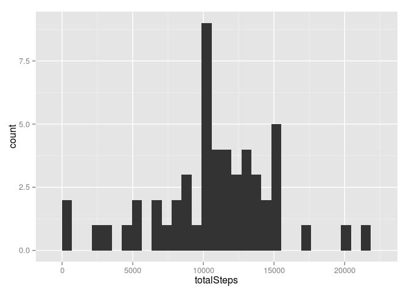
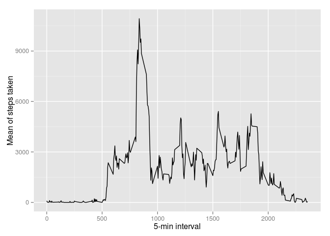
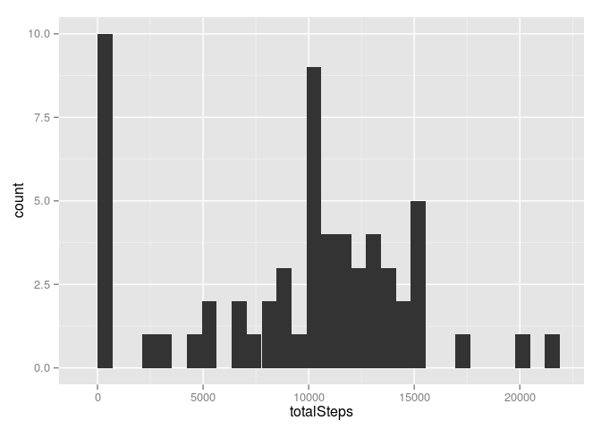
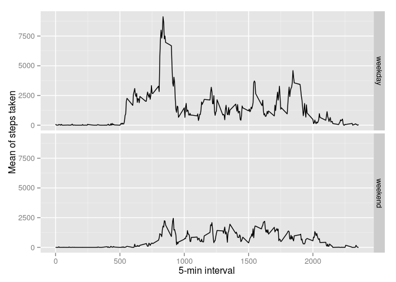

# Reproducible Research: Peer Assessment 1


## Loading and preprocessing the data
### Load libraries

```r
library(ggplot2)
library(dplyr)
```

```
## 
## Attaching package: 'dplyr'
## 
## The following object is masked from 'package:stats':
## 
##     filter
## 
## The following objects are masked from 'package:base':
## 
##     intersect, setdiff, setequal, union
```

### Set working directory

```r
setwd("~/Coursera/DSspec/RR/RepData_PeerAssessment1")
```

### Note I don't download things in this script as we are anyways cloning the repo with the files in it
### Unzip stuff if not already done

```r
if(!file.exists('activity.csv')){
  unzip('activity.zip')
}
```

### Load data into R, and clean away NA

```r
d <- read.csv("activity.csv")
data <- d[complete.cases(d),]
```

## What is mean total number of steps taken per day?
### Total nr of steps

```r
totalNrOfSteps <- data %>%
  group_by(date) %>%
  summarize(totalSteps = sum(steps)) 
```

### Mean and median

```r
meanNrOfSteps <- data %>%
  group_by(date) %>%
  summarize(meanSteps = mean(steps))

medianNrOfSteps <-data %>%
  group_by(date) %>%
  summarize(medianSteps = median(steps))
```

## What is the average daily activity pattern?
### Plot histogram over the number of steps

```r
g <- ggplot(totalNrOfSteps, aes(x = totalSteps))
g + geom_histogram()
```

 

### Calculate mean and median

```r
meanNrOfSteps <- mean(data$step, na.rm = TRUE)
medianNrOfSteps <- median(data$step, na.rm = TRUE)
```

### Time series stuff

```r
timeSerie <- data %>%
  group_by(interval) %>%
  summarize(IntervalMeanSteps = mean(sum(steps)))

g <- ggplot(data=timeSerie, aes(x = interval, y = IntervalMeanSteps))
g + geom_line() + 
  xlab("5-min interval") +
  ylab("Mean of steps taken")
```

 

```r
maxStepInterval <- which.max(timeSerie$IntervalMeanSteps)

nrNA <- length(which(is.na(d)))
```

## Imputing missing values
### strategy for filling in missing values: use mean of that day, if not all NA then use 0

```r
imputedData <- d
imputedData[imputedData$date == "2012-10-01",]$steps <- 0
imputedData[imputedData$date == "2012-10-08",]$steps <- 0
imputedData[imputedData$date == "2012-11-01",]$steps <- 0
imputedData[imputedData$date == "2012-11-04",]$steps <- 0
imputedData[imputedData$date == "2012-11-09",]$steps <- 0
imputedData[imputedData$date == "2012-11-10",]$steps <- 0
imputedData[imputedData$date == "2012-11-14",]$steps <- 0
imputedData[imputedData$date == "2012-11-30",]$steps <- 0
imputedData <- imputedData %>%
                    group_by(date) %>%
                    mutate(steps = replace(steps, is.na(steps), mean(steps, na.rm=TRUE)))


totalImputed <- imputedData %>%
  group_by(date) %>%
  summarize(totalSteps = sum(steps)) 
```
### Calculate mean and median

```r
imputedMean <- imputedData %>%
  group_by(date) %>%
  summarize(meanSteps = mean(steps))

imputedMedian <- imputedData %>%
  group_by(date) %>%
  summarize(medianSteps = median(steps))
```

### Plot histogram over the number of steps

```r
g <- ggplot(totalImputed, aes(x = totalSteps))
g + geom_histogram()
```

 

## Are there differences in activity patterns between weekdays and weekends?

```r
imputedData$date <- as.Date(imputedData$date)
imputedData <- imputedData %>%
  mutate(dayType = ifelse(weekdays(date) %in% c("lördag", "söndag"), "weekend", "weekday"))

newTimeSerie <- imputedData %>%
  group_by(interval, dayType) %>%
  summarize(IntervalMeanSteps = mean(sum(steps)))


g <- ggplot(data=newTimeSerie, aes(x = interval, y = IntervalMeanSteps))
g + geom_line() + facet_grid(dayType~.) +
  xlab("5-min interval") +
  ylab("Mean of steps taken")
```

 
